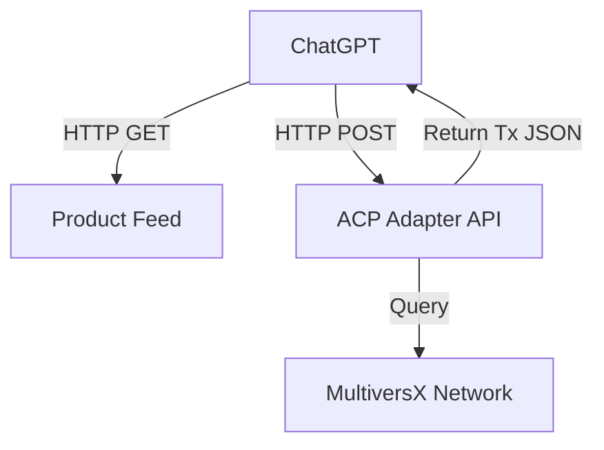

# Technical Specification: MultiversX ACP Adapter (Agentic Commerce)

## 1. Overview
This specification details the adapter required to make MultiversX compatible with the **OpenAI Agentic Commerce Protocol (ACP)**.

**Key Clarification: How Agents Buy Crypto/NFTs**
Standard ACP uses Stripe/Link for fiat. To support Crypto/NFTs, our Adapter must return a specialized **Action Payload** during compliance checks.
*   **Scenario**: ChatGPT User says "Buy this NFT".
*   **Flow**: Agent calls `/checkout` -> API returns "Sign this Tx" JSON -> Agent passes JSON to User's Wallet Plugin OR a connected Custodial Wallet Service.

## 2. Architecture
A lightweight **NestJS Microservice** (`multiversx-acp-adapter`).



## 3. Product Feed Specification
**URL**: `https://{host}/.well-known/acp/products.json`
**Source**: Indexer (SQS/Redis/Elastic) listening to `ListingCreated` events.

**JSON Schema:**
```json
{
  "products": [
    {
      "product_id": "unique_db_id",
      "title": "NFT Title",
      "description": "...",
      "price": {
        "amount": "100",
        "currency": "USDC" 
      },
      "custom_attributes": {
        "token_id": "...",
        "nonce": 123
      }
    }
  ]
}
```
*Note: OpenAI ACP prefers ISO currencies. Representing EGLD might require a custom currency code or USD equivalent for display.*

## 4. Checkout API Specification

### 4.1. Endpoint: `POST /checkout`
**Input**:
```json
{
  "cart_id": "...",
  "payment_method": "crypto_wallet"
}
```

**Output (The Crypto Extension):**
We return a `200 OK` with a `next_action`.

```json
{
  "status": "requires_action",
  "client_secret": "...", 
  "next_action": {
    "type": "use_dapp_wallet", 
    "dapp_url": "https://marketplace.multiversx.com/sign?tx_data=..." 
  }
}
```
*Alternative*: If the Agent has a "Crypto Plugin" installed, we return the raw raw `tx_json` for the plugin to sign.

## 5. Development Roles
*   **Backend Dev**: NestJS service setup.
*   **Blockchain Dev**: Event listener for Product Feed generation.
